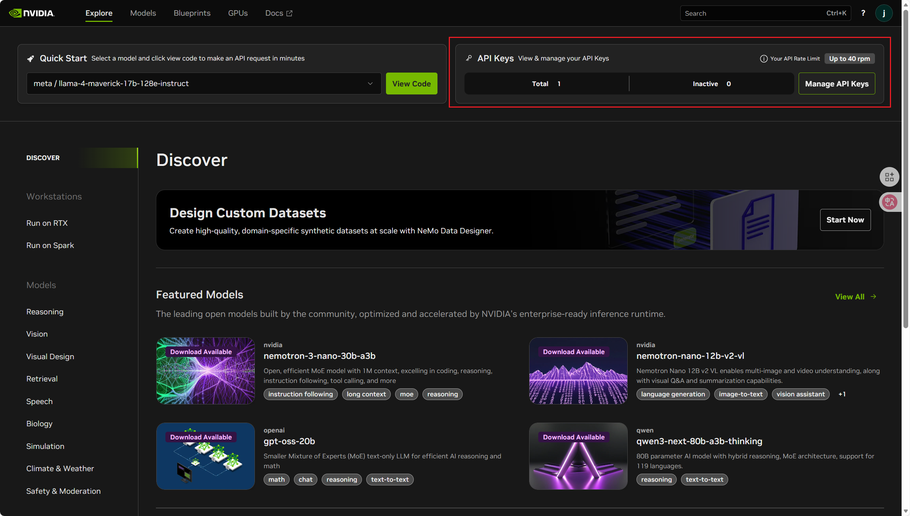

# 接入英伟达提供的免费模型
老黄大善人为我们提供了免费的deepseek-v3.2,glm5,kimi-k2.5等模型,虽然速度一般,可以免费接入,且对于我们速度也还够用.

## 注册
https://build.nvidia.com/explore/discover
- 注册账号,需要手机验证码(手打一下+86)

- 然后在右上角管理APIkey里面生成(注意一下过期时间)
- 复制到ACM助手的设置界面
- base_url 为https://integrate.api.nvidia.com
- 模型名参考:z-ai/glm5,deepseek-ai/deepseek-v3.2,moonshotai/kimi-k2.5...更多自行前往官网探索
- 开始生成题解吧!